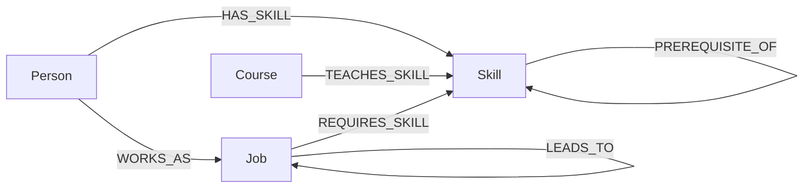

# SkillPath — Career Progression & Skill-Gap Graph Explorer

SkillPath answers a question people actually ask themselves: *"I'm here — how do I get there, and what am I missing?"*

It models **people, skills, jobs, and courses** as a graph in [CognoDB](https://console.cognodb.com) (openCypher over Bolt) and lets a non-technical user:

- **Explore** how a job or a skill connects to everything else in the map.
- Find the shortest **career path** between two roles.
- Run a **skill-gap analysis** for a person against a target role, with course recommendations.
- Find **mentors** — people already in a target role who share the most skills with you.

---

## Why a graph database?

The core questions in this app are all about *paths and overlap between things*, not rows:

- *"What's the shortest realistic route from Junior Developer to CTO?"* — the number of hops isn't known in advance. In Postgres this needs a **recursive CTE**, and it gets messy the moment you want the shortest one specifically. In Cypher it's one line: `shortestPath((start)-[:LEADS_TO*1..6]->(end))`.
- *"Which people share the most skills with me and already work my target job?"* — this is a friend-of-a-friend pattern (`Person -> Skill <- Person -> Job`) with aggregation and ranking baked into the traversal. In SQL that's a self-join through a bridge table, another join to a jobs table, a `GROUP BY`, and a `HAVING`/`ORDER BY` — four operations to express one idea.
- *"What am I missing for this job, and what teaches it?"* — a set-difference (required skills minus skills I have) chained straight into a second relationship type (courses). In Cypher it's a single pattern match with an `exists()` check; in SQL it's a `LEFT JOIN` + `NOT EXISTS` subquery + another `LEFT JOIN`.

None of this data is tabular by nature — it's a small mesh of typed connections — and every interesting query here is "walk N hops and tell me what's connected," which is precisely what a graph database is built to make cheap and readable.

---

## Data model



| Node | Key properties |
|---|---|
| `Person` | `id`, `name` |
| `Skill` | `id`, `name` |
| `Job` | `id`, `name`, `level` |
| `Course` | `id`, `name` |

| Relationship | Meaning | Properties |
|---|---|---|
| `(:Person)-[:HAS_SKILL]->(:Skill)` | This person has this skill | `level` (beginner/intermediate/advanced) |
| `(:Person)-[:WORKS_AS]->(:Job)` | This person's current role | — |
| `(:Job)-[:REQUIRES_SKILL]->(:Skill)` | This job needs this skill | `importance` (core/nice-to-have) |
| `(:Job)-[:LEADS_TO]->(:Job)` | Realistic next step on the career ladder | — |
| `(:Course)-[:TEACHES_SKILL]->(:Skill)` | This course teaches this skill | — |
| `(:Skill)-[:PREREQUISITE_OF]->(:Skill)` | Learn the source skill before the target | — |

The seed script loads 18 skills, 11 jobs, 17 courses, and 7 people — enough to demonstrate real multi-hop paths without needing a huge dataset.

---

## Project structure

```
skillpath/
├── backend/                 # Express API — talks to CognoDB via the official Neo4j driver
│   ├── src/
│   │   ├── server.js        # app entrypoint, health check, error handling
│   │   ├── db.js            # driver connection + parameterized query runner
│   │   ├── neo4jUtil.js      # Integer -> Number helper
│   │   └── routes/
│   │       ├── skills.js
│   │       ├── jobs.js
│   │       ├── people.js
│   │       └── career.js    # the multi-hop / skill-gap / mentor queries
│   ├── seed/
│   │   ├── seedData.js      # all sample data, as plain JS arrays
│   │   └── seed.js          # loads seedData.js into CognoDB with parameterized Cypher
│   ├── package.json
│   └── .env.example
└── frontend/                 # Static site, no build step
    ├── index.html
    ├── style.css
    ├── app.js
    └── config.js             # points the frontend at your deployed backend URL
```

---

## 1. Set up CognoDB Cloud

1. Go to **[console.cognodb.com/signup](https://console.cognodb.com/signup)** and create a free account (no credit card required).
2. Create a **free (c0) instance** and pick a region. It provisions in under a minute.
3. Copy the connection URI (`bolt+s://<instance-id>.databases.cognodb.cloud`) and the generated password for user `cognodb` — **the password is shown once**, so save it immediately.

The free tier (0.5 vCPU burstable, 256 MB RAM, 1 GB disk) is more than enough for this dataset — it's a few dozen nodes and under 200 relationships.

## 2. Run the backend locally

```bash
cd backend
npm install
cp .env.example .env
# edit .env with your COGNODB_URI and COGNODB_PASSWORD
npm run seed     # loads the sample graph into your CognoDB instance
npm start        # starts the API on http://localhost:4000
```

Visit `http://localhost:4000/api/health` — you should see `{"status":"ok","database":"connected"}`. If CognoDB is unreachable, this returns a `503` with a clear message instead of the whole server crashing.

## 3. Run the frontend locally

The frontend has no build step — it's plain HTML/CSS/JS.

```bash
cd frontend
# open frontend/config.js and confirm it points at http://localhost:4000/api
npx serve .        # or any static file server, or just open index.html directly
```

---

## The main queries, explained

All four live in `backend/src/routes/career.js` (plus two supporting ones in `skills.js` / `jobs.js`). Every query is parameterized (`$personId`, `$jobId`, etc.) — there is no string concatenation into Cypher anywhere in this codebase.

**1. Shortest career path (multi-hop, variable length)**
```cypher
MATCH (start:Job {id: $from}), (end:Job {id: $to})
MATCH path = shortestPath((start)-[:LEADS_TO*1..6]->(end))
RETURN [n IN nodes(path) | {id: n.id, name: n.name}] AS jobs, length(path) AS hops
```
Finds the shortest chain of `LEADS_TO` edges between two roles, however many hops that turns out to be.

**2. Skill-gap analysis (set-difference + second relationship type)**
```cypher
MATCH (p:Person {id: $personId})
MATCH (j:Job {id: $jobId})-[:REQUIRES_SKILL]->(req:Skill)
WITH p, j, req, exists((p)-[:HAS_SKILL]->(req)) AS alreadyHave
OPTIONAL MATCH (c:Course)-[:TEACHES_SKILL]->(req)
WITH j, req, alreadyHave, collect(DISTINCT c.name) AS courses
RETURN j.name AS jobName, collect({skill: req.name, alreadyHave: alreadyHave, courses: courses}) AS breakdown
```
For every skill a job requires, checks whether the person already has it, and if not, which courses teach it.

**3. Mentor finder (2-hop pattern with ranking)**
```cypher
MATCH (p:Person {id: $personId})-[:HAS_SKILL]->(shared:Skill)<-[:HAS_SKILL]-(mentor:Person)-[:WORKS_AS]->(j:Job {id: $targetJobId})
WHERE mentor.id <> $personId
RETURN mentor.id AS id, mentor.name AS name, count(DISTINCT shared) AS sharedSkillCount, collect(DISTINCT shared.name) AS sharedSkills
ORDER BY sharedSkillCount DESC
LIMIT 5
```
Walks from a person, out to shared skills, back in to other people, and out to their current job — all in one traversal.

**4. Job requirements graph (2-hop fan-out)**
```cypher
MATCH (j:Job {id: $id})-[r:REQUIRES_SKILL]->(s:Skill)
OPTIONAL MATCH (c:Course)-[:TEACHES_SKILL]->(s)
RETURN j, s, r.importance AS importance, collect(DISTINCT c) AS courses
```
Used by the Explore tab to draw a job's required skills and the courses that teach each one.

---

## Deploying for free

**Database:** already free — your CognoDB c0 instance.

**Backend (Render free tier):**
1. Push this repo to GitHub.
2. On [render.com](https://render.com), create a **Web Service**, point it at the `backend/` folder (root directory: `backend`).
3. Build command: `npm install`. Start command: `npm start`.
4. Add environment variables `COGNODB_URI`, `COGNODB_USER`, `COGNODB_PASSWORD`, and `CORS_ORIGIN` (set this to your deployed frontend URL once you have it).
5. Note: Render's free tier spins down after inactivity, so the first request after idle can take ~30s to wake up — the health check and loading states in the UI are designed to make that visible rather than look broken.

**Frontend (Vercel or Netlify free tier):**
1. Import the same repo, set the project root to `frontend/`.
2. No build command needed — it's static files.
3. Before deploying, edit `frontend/config.js` to point `window.API_BASE` at your deployed Render URL (e.g. `https://skillpath-api.onrender.com/api`).

---

## Error handling

- The API's `/api/health` endpoint explicitly checks driver connectivity and returns a `503` with a message on failure, rather than letting individual routes throw raw driver errors.
- The frontend polls `/api/health` every 30s and shows a persistent "Database unreachable" status pill instead of silently failing.
- Every route wraps its query in try/catch and forwards errors to a centralized Express error handler, so a bad query or timeout never crashes the process.
- Empty states are explicit everywhere: the Explore graph, and every result panel, show a plain-language message instead of a blank box when there's nothing to show yet.

---

## Screenshots

*(Add screenshots of the Explore, Career Path, Skill Gap, and Mentor tabs here before submitting, along with a short screen recording per the assignment's deliverables.)*
